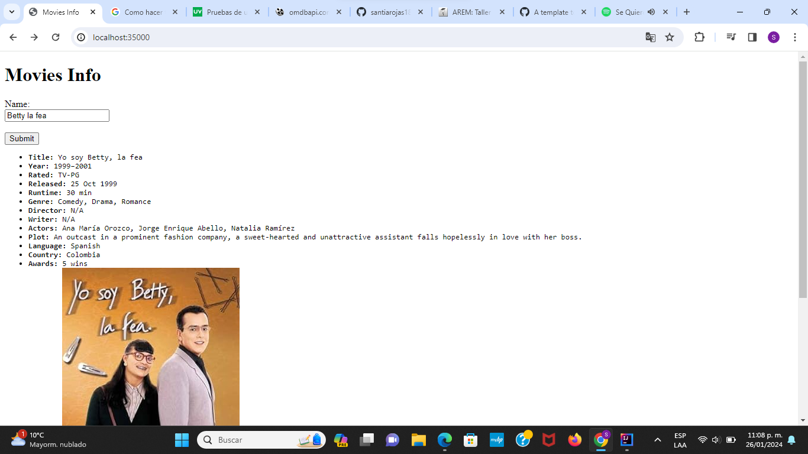

### Escuela Colombiana de Ingeniería

### Arquitecturas Empresariales

#### TALLER 1: APLICACIONES DISTRIBUIDAS (HTTP, SOCKETS, HTML, JS,MAVEN, GIT)

#### Santiago Arévalo Rojas

### Instrucciones para ejecución

Para ejecutar la aplicación se deben seguir los siguientes pasos:  
1. Se debe clonar el repositorio de github con el enlace dado en la entrega, el cual es: [https://github.com/santiarojas18/Lab1AREP.git](https://github.com/santiarojas18/Lab1AREP.git)  
2. Una vez clonado se debe abrir el proyecto en el IDE de preferencia, en este caso se abrió en IntelliJ:  
     
3. Luego en el directorio src vamos a la clase HttpServer que es la clase web server con la api fachada, en la cual se tiene la función main:  
      
4. Al ejecutar la aplicación desde el IDE evidenciamos que el servidor efectivamente está prendido y esperando por peticiones:  
      
5. Para ver el correcto funcionamiento nos dirigimos a un navegador, en este caso a google y nos conectamos por medio de la URL de localhost que está escuchando por el puerto 35000, [http://localhost:35000/](http://localhost:35000/):  
      
6. Una vez dentro de la página podemos preguntar por la información de cualquier película deseada, en este caso preguntamos por "Son como niños", para esto ingresamos el nombre en el campo y le damos click al botón que dice Submit:  
      
    
7. Si deseamos realizar una nueva consulta basta con escribir otro nombre en dicho campo, dar click en el botón y aparecerá la información de la nueva búsqueda:  
      
      

### Información del diseño

Con el fin de respetar la arquitectura solicitada, se crea la clase HttpServer que es la clase WbServer con la api fachada, esta clase utiliza a la clase HttpConnectionExample, esta clase es la que se encarga de realizar la conexión a la API externa, se realizó de esta manera para que se cumpliera con la única responsabilidad de las clases, además de ayudar con la modularidad y extensibilidad de la aplicación, debido a que si se quisiera hacer un cambio a la API que se va a consumir basta con modificar el atributo GET_URL de la clase:  
  
Por otra parte, para que las peticiones a la API externa se realicen de forma sencilla se crea el método getMovieInfo que tiene como parámetro el nombre de la película a buscar y simplemente se la concatena al GET_URL, con esto, en la clase HttpServer la solicitud a la API se realiza de forma sencilla:  
  
Donde connectionToApi es un objeto de la clase HttpConnectionExample.  
Para la condición del caché se decidió agregar un atributo en la clase HttpServer de tipo ConcurrentHashMap para asegurarse que sea tolerante a la concurrencia, su funcionamiento se basa en verificar si la película que se está consultando ya está en el HashMap, si ya se encuentra entonces no es necesario consultarla a la API externa, de lo contrario hace la petición y guarda la respuesta en el HashMap, este funcionamiento se logró con el siguiente código:  
  
Finalmente en cuanto a las pruebas se comentó en clase que no se debían hacer las pruebas concurrentes, sin embargo, se realizaron pruebas para evidenciar que la consulta a la API externa se estuviera realizando de manera correcta, las cuales se pueden evidenciar ejecutando la clase de test, llamada AppTest que se encuentra en el directorio test.  
